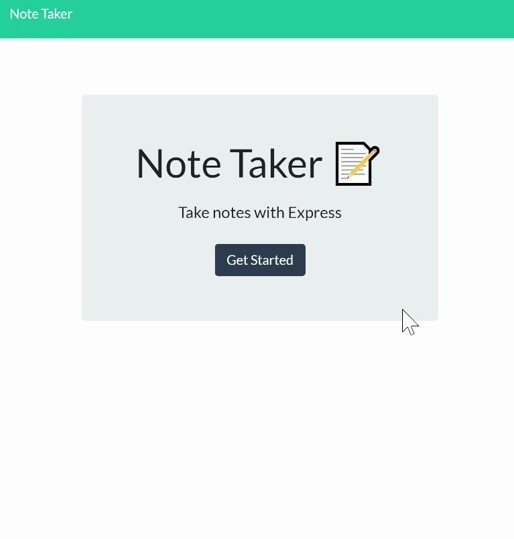

# NoteTakerApp

  ## Table of Contents
  * [Description](#description)
  * [Installation](#installation)
  * [Usage](#usage)
  * [Deployed](#deployed)
  * [Credits](#credits)
  * [License](#license)
  * [Features](#features)
  * [Contributing](#contributing)

  ## Description
  This application is can be used to easily write, save, and delete notes. 

  The technologies used include: 
  * Express
  * Node.js
  * CSS
  * HTML
  
  ## Installation
  Since this is a deployed application, in order be able to use this application, the user needs to go to the application link and start writing notes. There is no need to install any other technologies. You can look at the gif for a step-by-step demostration. 

  ## Usage 
  This is a preview of how the Web application Looks Like: 
  
  

  ## Deployed Application 
  The link to the published application can be accessed on the following link: 
  (https://easynotesapp.herokuapp.com/).

  ## License
  Licensed under the MIT license.

  ## Badges
  
  

  ## Contributing
  To contribute to this README generator you can create a pull request or email me at mariaocampo0513@gmail.com for more questions.

  - - -
  Copyright &copy; 2020 Maria Ocampo. All Rights Reserved.
